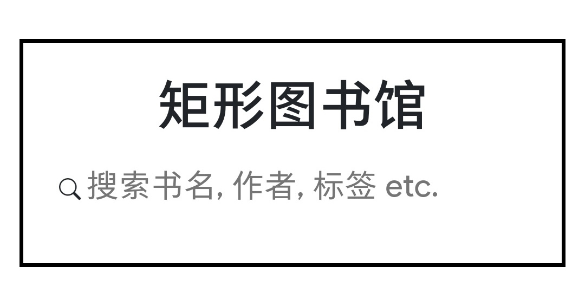

# RECLIB

> A Web app, simple but not crude, dedicated to learning programming in practice.

[![LICENSE]][license]
[![ISSUES]][issues]
[![RELESE]][relese]
[![downloads]][downloads]
[![build]][build]

<p align="center">
  
</p>

## Run

```bash
$ git clone git@github.com:HuuLane/RECLIB-BACKEND.git
$ docker-compose up -d

# then go to http://localhost:3000/
```

## Note

- [Warning:](https://github.community/t5/GitHub-Actions/docker-pull-from-public-GitHub-Package-Registry-fail-with-quot/td-p/32782) At present you **do need to authenticate** to pull even publicly available packages in Github, so the following step is necessary:

  1.  [To creat token](https://help.github.com/en/github/authenticating-to-github/creating-a-personal-access-token-for-the-command-line)

  2.  authenticate

      ```
      cat ~/TOKEN.txt | docker login docker.pkg.github.com -u USERNAME --password-stdin
      ```

- ~~The npm have been set a third party registry in Dockerfile due to China network.~~

<!-- Markdown link & img dfn's -->

[license]: https://img.shields.io/github/license/HuuLane/RECLIB-BACKEND?style=flat-square
[issues]: https://img.shields.io/github/issues/HuuLane/RECLIB-BACKEND?style=flat-square
[relese]: https://img.shields.io/github/v/tag/HuuLane/RECLIB-BACKEND?style=flat-square
[downloads]: https://img.shields.io/github/downloads/HuuLane/RECLIB-BACKEND/total
[build]: https://img.shields.io/github/workflow/status/HuuLane/RECLIB-BACKEND/Docker
